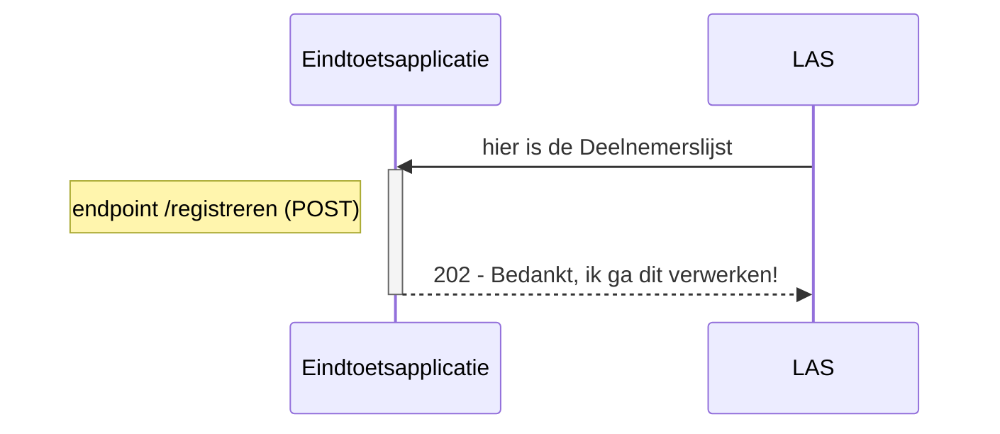
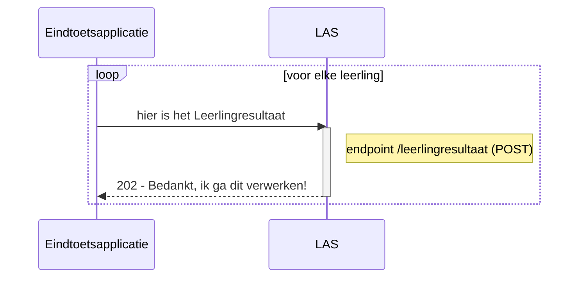
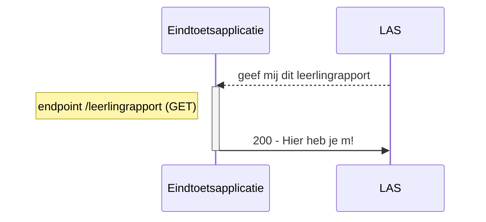

# Defs bij afsprakenset "Logistiek proces Eindtoets po"
De OAS3-definities (Defs) in YAML-bestand "eindtoetsketen-openapi.yaml" zijn bedoeld voor de REST API t.b.v. Logisieke proces rondom de Eindtoets PO voor schooljaar 2022-2023. 

Deze uitwisseling omvat 3 interacties die schematisch worden gepresenteerd in de drie onderstaande sequencedisgrammen.

Iedere publicatie van dit YAML-bestand voor de eindtoetsketen is een getagde versie en is beschikbaar onder releases: https://github.com/JosVanderArend/eindtoets/releases. Daar zijn tevens hulpmiddelen beschikbaar om getagde versies te vergelijken. 
Er kan maximaal worden teruggekeken naar en vergeleken met de definitieve versie van het schooljaar 2020-2021 (hoewel deze versie door een aangepaste inrichting enigszins beperkt is).

Indien er problemen of verbetersuggesties zijn specifiek over de YAML dan graag indienen onder issues: https://github.com/JosVanderArend/eindtoets/issues.

De actuele versie van deze OAS3-definities kan met de Swagger Editor worden ingezien via deze link: https://editor.swagger.io/?url=https://raw.githubusercontent.com/JosVanderArend/eindtoets/main/eindtoetsketen-openapi.yaml. 
 

